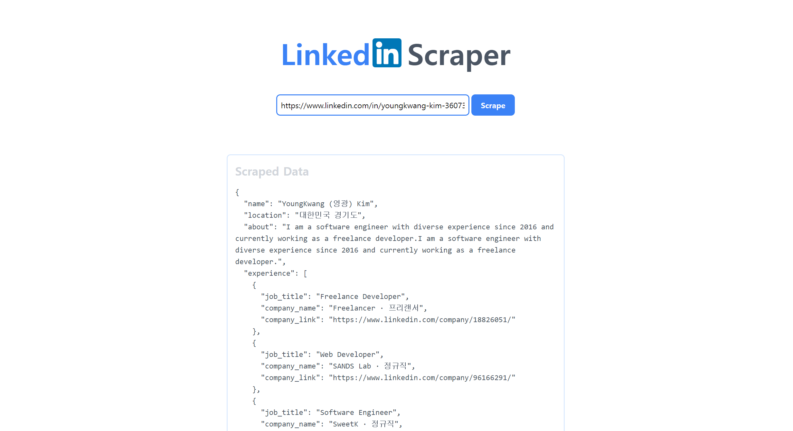

# LinkedIn Profile Scraper (Company option will be updating soon 🚀)

[//]: # ([![forthebadge]&#40;https://forthebadge.com/images/badges/open-source.svg&#41;]&#40;https://forthebadge.com&#41;)

[](https://forthebadge.com)
[](https://forthebadge.com)

This project is a web application that scrapes LinkedIn profiles that provide public information. 




This scraper will extract publicly available data: 

**🧑‍🎨 Profile:** ......name, talks about, location

**👨‍💼 Experiences:** ....job title, company name, company url

**🗺️ Education:** ... name, period

## Stacks
```angular2html
Django 5.0.7
Python 3.10.11
tailwindcss 3.0.0
selenium 4.23.1
```

## Prerequisites
- make login_info.txt file in root directory and write your linkedin email and password
```angular2html
your_email  # first line your_email
your_password  # second line your_password
```
  
## How to Run 

- Clone the repository
- Install Requirements
```bash
$ pip install -r requirements.txt
```
-  Run Django Server
```bash
$ python manage.py runserver
```

- Tailwind Build (for development)
```bash
$ npx tailwindcss -i ./static/src/input.css -o ./static/src/output.css --watch
```

## Contact

For any feedback or queries, please reach out to me at [kimyk0120@gmail.com](kimyk0120@gmail.com).

